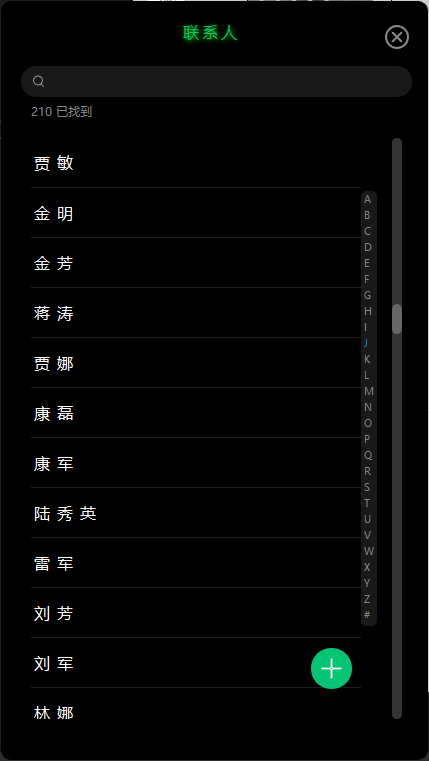

## 🧛‍通讯录管理
C++ Qt实现的通讯录管理，仅用于`数据结构课程设计(2023-06-16)`，所以功能实现并不完善。  
课程要求使用链表，所以核心采用链表实现。  
之前没写过C++，第一次尝试C++，写的💩一样的代码。

## 🛹具体功能
1. 添加联系人
2. 显示联系人
3. 删除联系人
4. 查找联系人
5. 修改联系人

支持保存到文件，读取文件(Json)。  
支持拼音搜索、模糊查询、姓名首字母分类、点击字母跳转  
主界面按照首字母顺序排序

## 🖼️程序截图



## 📦链表定义部分
```cpp
class Contact {
public:
    std::string name;
    std::string company;
    std::string position;
    std::string phone;
    std::string email;
    std::string avatar;
    std::string address;
    Contact* next;

    QJsonObject toJson() const;
    static Contact fromJson(const QJsonObject& json);
};

class ContactList {
public:
    ContactList();

    void addContact(Contact* contact);
    void deleteContact(std::string phone);
    void editContact(Contact* contact);
    void sortByName();
    void sortByPhone();
    void printContacts();
    bool isContactExists(std::string phone);
    bool loadFromFile(const std::string& filename);
    bool saveToFile(const std::string& filename);
    Contact* getHead();
    Contact* getContactByPhone(std::string phone);

private:
    Contact* head;

};
```